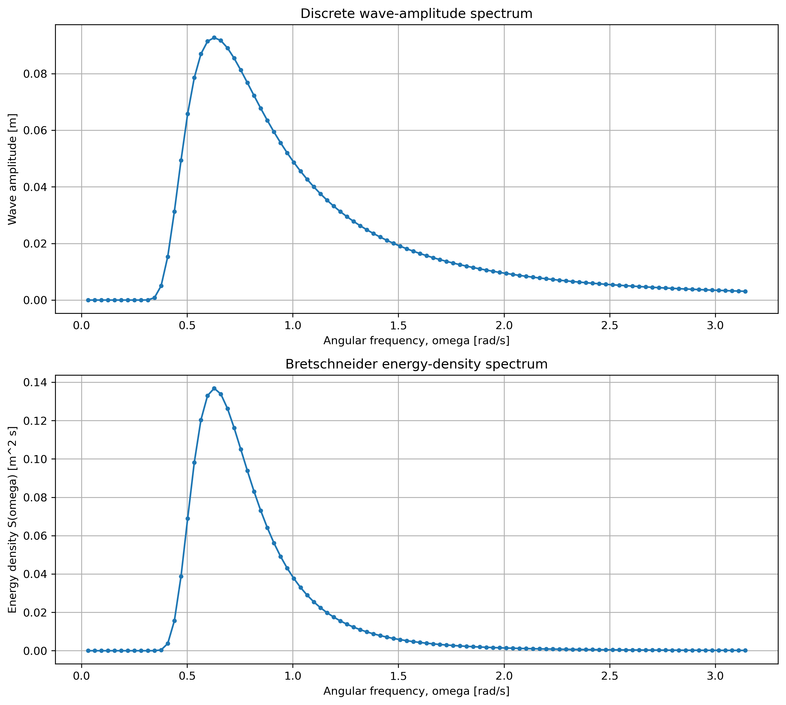
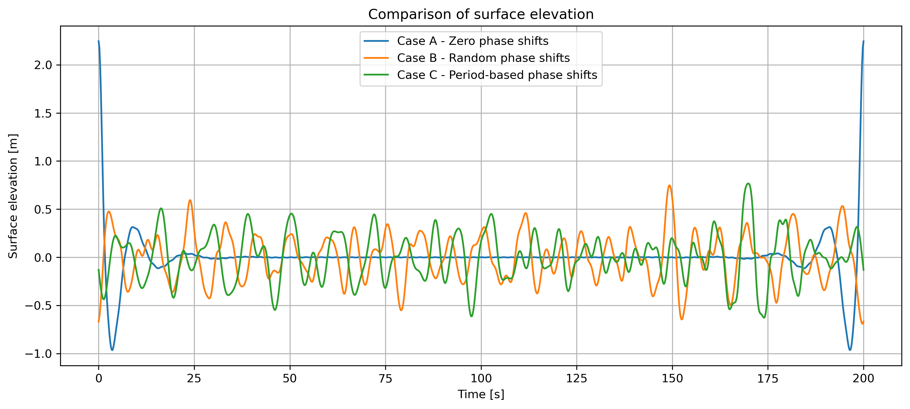
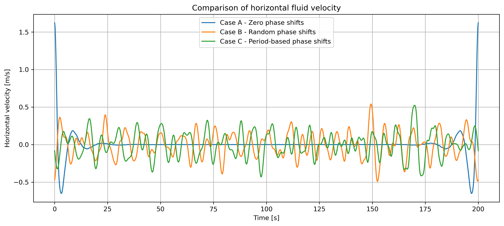
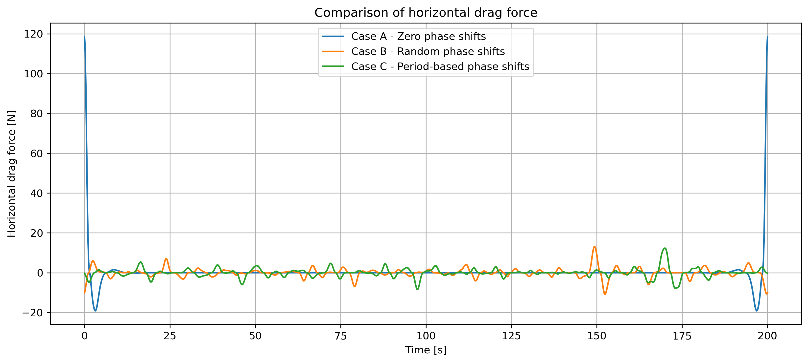

# Ocean Wave Spectra & Drag Force Simulation

Time-domain numerical simulation of wave-induced drag forces on a submerged spherical housing using Airy wave theory and the Bretschneider spectrum.

---

## Documentation & LaTeX Report

* 📄 **Overleaf Project:** [View Live LaTeX Source & Document](https://www.overleaf.com/read/trpmjsvzjrym#34167e)
* 📥 **Project Report:** [Download Report PDF](./Ocean_Waves_Drag_Forces_Report.pdf)

> **Abstract:** This study investigates the horizontal wave-induced drag force acting on a fixed spherical camera housing mounted beneath a stationary offshore platform. The prescribed fully developed wind-generated sea ($H_s = 0.98\text{ m}$, $T_p = 10\text{ s}$) was represented using a Bretschneider spectrum discretized into 100 harmonic components. Subsurface velocity and drag forces were evaluated across zero-phase, random-phase, and period-based phase configurations.

---

## Technical Overview

- **Wave Theory:** Linear Airy Wave Theory
- **Spectrum Model:** Bretschneider Energy-Density Spectrum ($H_s = 0.98\text{ m}$, $T_p = 10.0\text{ s}$)
- **Water Depth ($h$):** $98.1\text{ m}$
- **Submerged Structure:** Submerged housing at depth $z = -2.0\text{ m}$ ($C_d = 0.45$, $D = 0.50\text{ m}$)
- **Phase Shift Cases:**
  - **Case A:** Zero phase shifts ($\phi_i = 0$)
  - **Case B:** Uniformly distributed random phase shifts ($\phi_i \sim U[0, 2\pi)$)
  - **Case C:** Period-dependent phase shifts ($\phi_i = 2\pi T_i^2$)

---

## Key Results & Figures

### 1. Bretschneider Energy Spectrum


### 2. Surface Elevation Comparison


### 3. Horizontal Fluid Velocity Comparison


### 4. Hydrodynamic Drag Force Comparison


---

## Repository Structure


```text
├── src/
│   ├── airyLib.py              # Wave kinematics & Bretschneider spectrum solver
│   └── main_simulation.py      # Time-series generator & plot exporter
├── results/                    # Generated high-resolution visualization plots
├── Ocean_Waves_Drag_Forces_Report.pdf
└── README.md
```


## How to Run

1. Clone the repository:
   ```bash
   `git clone https://github.com/MostafaGhodsi/ocean-wave-drag-force-simulation.git`
   `cd ocean-wave-drag-force-simulation`
   ```
2. Run the main simulation:
  ```bash
   `python src/main_simulation.py`
   ```
---

## Authors

- **Mostafa Ghodsi** - *University of Rostock*
- Team Contributors: Fatemeh Moradimoradpour, Mahsa Zareibagher, Shayan Mohammadsharif
